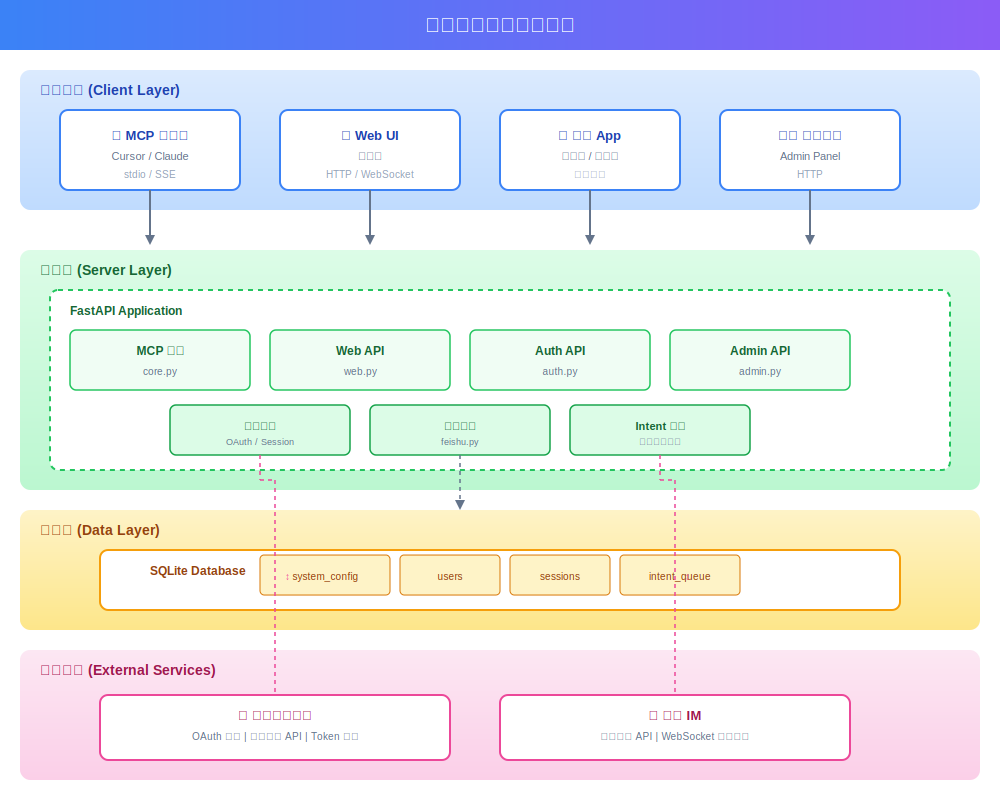
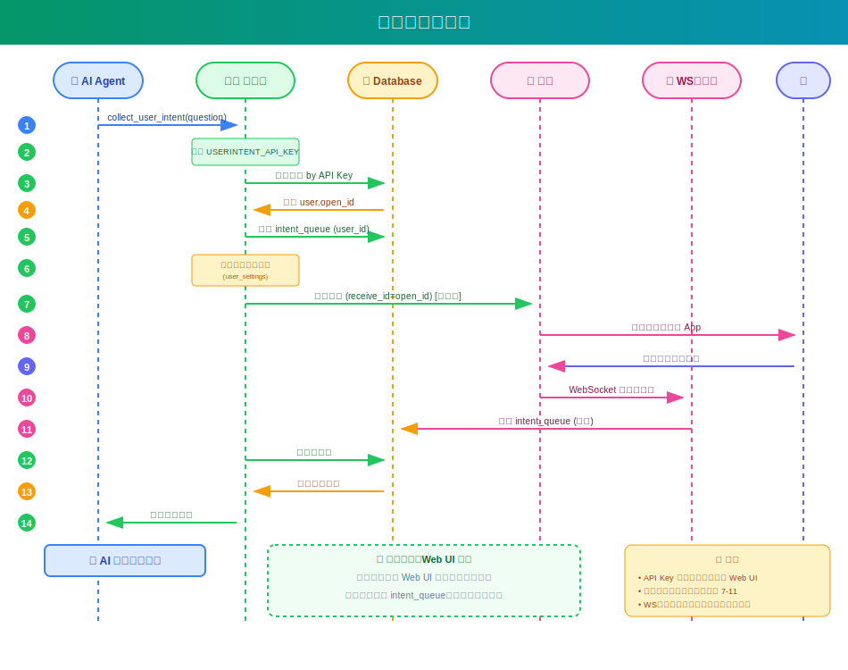
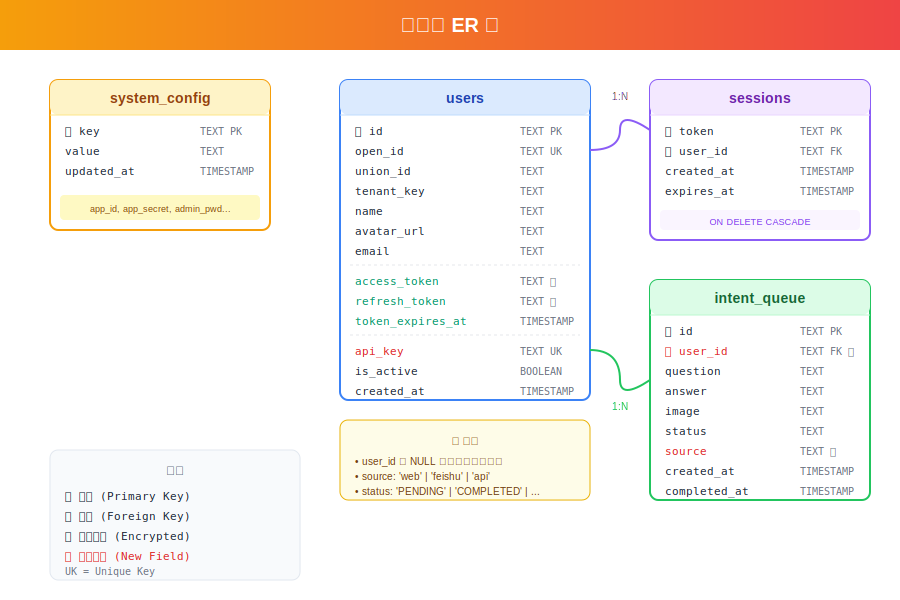

# 飞书多租户功能开发计划

## 1. 系统架构

### 1.1 整体架构图



**架构说明：**
- **客户端层**：MCP 客户端（Cursor等）、Web UI、飞书 App、管理后台
- **服务层**：FastAPI 应用，包含 MCP 服务、Web API、Auth API、Admin API
- **数据层**：SQLite 数据库，存储系统配置、用户、会话、意图队列
- **外部服务**：飞书开放平台（OAuth 认证）、飞书 IM（消息收发）

### 1.2 进程架构

```
┌─────────────────────────────────────────────────────────────────┐
│                     单一入口启动                                  │
│                                                                  │
│  uvicorn web_multi_tenant:app --host 0.0.0.0 --port 8000        │
│                                                                  │
├─────────────────────────────────────────────────────────────────┤
│                                                                  │
│  ┌─────────────────────────────────────────────────────────┐    │
│  │  主进程 (FastAPI/Uvicorn)                                │    │
│  │  - Web API 服务                                          │    │
│  │  - OAuth 认证                                            │    │
│  │  - 管理后台 API                                          │    │
│  │  - 飞书消息发送                                          │    │
│  └─────────────────────────────────────────────────────────┘    │
│                          │                                       │
│                          │ 启动子进程                            │
│                          ▼                                       │
│  ┌─────────────────────────────────────────────────────────┐    │
│  │  子进程 (FeishuWSListener)                               │    │
│  │  - WebSocket 长连接                                      │    │
│  │  - 接收飞书消息回复                                      │    │
│  │  - 写入数据库                                            │    │
│  └─────────────────────────────────────────────────────────┘    │
│                                                                  │
│  配置更新时自动重启子进程                                        │
│                                                                  │
└─────────────────────────────────────────────────────────────────┘
```

### 1.3 核心流程

#### 1.3.1 用户认证流程


**流程说明：**
1. 用户点击"飞书登录"按钮
2. Web UI 请求 Server 生成 OAuth URL
3. Server 生成带 state 参数的授权 URL
4. 用户被重定向到飞书授权页面
5. 用户在飞书授权页面点击"授权"
6. 飞书回调 Server，携带授权码 code
7. Server 用 code 换取 access_token 和用户信息
8. Server 创建/更新用户，生成 Session 和 API Key
9. 设置 Cookie，重定向到用户中心

#### 1.3.2 消息收发流程



**流程说明：**
1. AI Agent 调用 `collect_user_intent(question)`
2. Server 读取环境变量 `USERINTENT_API_KEY`
3. 根据 API Key 查询数据库获取用户信息
4. 将问题存储到 intent_queue（**包含 user_id**）
5. 检查用户飞书通知开关，如开启则发送飞书消息
6. 用户在飞书中收到消息并回复
7. WebSocket 子进程接收回复并写入数据库
8. 主进程轮询数据库，返回回复给 AI Agent

#### 1.3.3 消息用户隔离架构

```
┌─────────────────────────────────────────────────────────────────┐
│                     MCP Server                                   │
├─────────────────────────────────────────────────────────────────┤
│                                                                  │
│  ┌─────────────────┐     ┌─────────────────┐                    │
│  │  AI Agent A     │     │  AI Agent B     │                    │
│  │  env: API_KEY=  │     │  env: API_KEY=  │                    │
│  │    uk_A         │     │    uk_B         │                    │
│  └────────┬────────┘     └────────┬────────┘                    │
│           │                       │                              │
│           ▼                       ▼                              │
│  ┌────────────────────────────────────────────────────────────┐ │
│  │              collect_user_intent(question)                  │ │
│  │  1. 读取 USERINTENT_API_KEY 环境变量                        │ │
│  │  2. 调用 get_user_by_api_key(api_key) 获取 user            │ │
│  │  3. user_id = user.open_id (或 NULL 如果无 API Key)        │ │
│  └────────────────────────────────────────────────────────────┘ │
│           │                       │                              │
│           ▼                       ▼                              │
│  ┌────────────────────────────────────────────────────────────┐ │
│  │                    intent_queue 表                          │ │
│  │  ┌──────────────────────┬──────────────────────┐           │ │
│  │  │ user_id = ou_A       │ user_id = ou_B       │           │ │
│  │  │ question: "问题A"    │ question: "问题B"    │           │ │
│  │  └──────────────────────┴──────────────────────┘           │ │
│  │  ┌──────────────────────┐                                  │ │
│  │  │ user_id = NULL       │  ← 无登录模式的消息              │ │
│  │  │ question: "公共问题" │                                  │ │
│  │  └──────────────────────┘                                  │ │
│  └────────────────────────────────────────────────────────────┘ │
│           │                       │               │              │
│           ▼                       ▼               ▼              │
│  ┌────────────────┐  ┌────────────────┐  ┌────────────────┐     │
│  │  /api/poll     │  │  /api/poll     │  │  /api/poll     │     │
│  │  ?api_key=uk_A │  │  ?api_key=uk_B │  │  (无 api_key)  │     │
│  │  只返回 A 的   │  │  只返回 B 的   │  │  只返回 NULL   │     │
│  │  消息          │  │  消息          │  │  的消息        │     │
│  └────────────────┘  └────────────────┘  └────────────────┘     │
│           │                       │               │              │
│           ▼                       ▼               ▼              │
│  ┌────────────────┐  ┌────────────────┐  ┌────────────────┐     │
│  │  WebUI A       │  │  WebUI B       │  │  WebUI (无登录)│     │
│  │  /webui?api_   │  │  /webui?api_   │  │  /webui        │     │
│  │  key=uk_A      │  │  key=uk_B      │  │                │     │
│  └────────────────┘  └────────────────┘  └────────────────┘     │
│                                                                  │
└─────────────────────────────────────────────────────────────────┘
```

**消息隔离规则：**

| 场景 | API Key 配置 | intent_queue.user_id | WebUI 可见性 |
|------|-------------|---------------------|-------------|
| 飞书用户 A | `USERINTENT_API_KEY=uk_A` | `ou_A` | 只有携带 `api_key=uk_A` 的 WebUI 可见 |
| 飞书用户 B | `USERINTENT_API_KEY=uk_B` | `ou_B` | 只有携带 `api_key=uk_B` 的 WebUI 可见 |
| 无登录模式 | 未配置 | `NULL` | 只有不携带 `api_key` 的 WebUI 可见 |

---

## 2. 数据库设计

### 2.1 ER 图



**表关系说明：**
- `admin_config`：存储管理员配置（用户名、密码、飞书凭证等）
- `admin_sessions`：存储管理员会话
- `users`：存储用户信息，包含飞书 OAuth 返回的信息和 API Key
- `user_settings`：存储用户设置（如飞书通知开关）
- `intent_queue`：存储 AI 请求队列，包含 user_id 支持多用户

### 2.2 表结构详细设计

#### admin_config 表
```sql
CREATE TABLE admin_config (
    key TEXT PRIMARY KEY,
    value TEXT NOT NULL
);

-- 预置配置项
-- admin_username: 管理员用户名
-- admin_password_hash: 管理员密码哈希 (PBKDF2-SHA256)
-- feishu_app_id: 飞书应用 ID
-- feishu_app_secret: 飞书应用密钥
-- feishu_redirect_uri: OAuth 回调地址
-- system_initialized: 系统是否已初始化
```

#### admin_sessions 表
```sql
CREATE TABLE admin_sessions (
    token TEXT PRIMARY KEY,
    created_at REAL NOT NULL,
    expires_at REAL NOT NULL
);
```

#### users 表
```sql
CREATE TABLE users (
    open_id TEXT PRIMARY KEY,           -- 飞书 open_id
    union_id TEXT,                       -- 飞书 union_id
    user_id TEXT,                        -- 飞书 user_id
    tenant_key TEXT,                     -- 租户标识（预留多租户）
    name TEXT,                           -- 用户姓名
    en_name TEXT,                        -- 英文名
    avatar_url TEXT,                     -- 头像 URL
    avatar_thumb TEXT,                   -- 头像缩略图
    email TEXT,                          -- 邮箱
    mobile TEXT,                         -- 手机号
    -- Token 存储（用于扩展飞书功能）
    access_token TEXT,                   -- user_access_token
    refresh_token TEXT,                  -- refresh_token
    token_expires_at INTEGER,            -- token 过期时间
    -- API Key（用于 MCP 认证）
    api_key TEXT UNIQUE,                 -- 用户专属 API Key (uk_ 前缀)
    -- 状态
    created_at INTEGER,                  -- 创建时间戳
    last_login_at INTEGER,               -- 最后登录时间戳
    is_active INTEGER DEFAULT 1          -- 是否启用
);

CREATE INDEX idx_users_api_key ON users(api_key);
```

#### user_settings 表
```sql
CREATE TABLE user_settings (
    user_id TEXT NOT NULL,
    key TEXT NOT NULL,
    value TEXT,
    PRIMARY KEY (user_id, key)
);

-- 预置设置项
-- feishu_notify_enabled: 是否开启飞书通知 ("1" 或 "0")
```

#### intent_queue 表
```sql
CREATE TABLE intent_queue (
    id TEXT PRIMARY KEY,
    question TEXT NOT NULL,
    answer TEXT,
    image TEXT,
    status TEXT DEFAULT 'PENDING',
    user_id TEXT,                        -- 关联用户 open_id (NULL 表示公共消息)
    created_at TIMESTAMP DEFAULT CURRENT_TIMESTAMP,
    completed_at TIMESTAMP
);

CREATE INDEX idx_intent_queue_user_id ON intent_queue(user_id);
CREATE INDEX idx_intent_queue_status ON intent_queue(status);
```

---

## 3. 模块设计

### 3.1 文件结构

```
src/
├── __init__.py
├── __main__.py              # 入口
├── server.py                # 服务启动 (单用户模式)
├── core.py                  # MCP 工具核心逻辑 ✅
├── web.py                   # Web API (单用户模式)
├── web_multi_tenant.py      # Web API (多租户模式) ✅
├── feishu.py                # 飞书服务 (发送消息) ✅
├── feishu_ws_listener.py    # 飞书 WebSocket 监听器 ✅
├── auth.py                  # 管理员认证 ✅
├── oauth.py                 # 飞书 OAuth ✅
├── users.py                 # 用户管理 ✅
├── routing.py               # 消息路由 ✅
├── static/
│   └── sw.js
└── templates/
    ├── index.html           # Web UI ✅
    └── multi_tenant.html    # 多租户登录页 ✅
```

### 3.2 模块职责

#### auth.py - 管理员认证模块 ✅
```python
"""
管理员认证模块 - 处理管理员登录和会话管理
"""

class AdminAuth:
    def __init__(self, db_path: str): ...
    
    def is_initialized(self) -> bool:
        """检查系统是否已初始化"""
    
    def initialize(self, username: str, password: str) -> None:
        """初始化管理员账号"""
    
    def verify_credentials(self, username: str, password: str) -> bool:
        """验证管理员凭证"""
    
    def create_session(self) -> str:
        """创建会话，返回 token"""
    
    def validate_session(self, token: str) -> bool:
        """验证会话是否有效"""
    
    def invalidate_session(self, token: str) -> None:
        """使会话失效"""
```

#### oauth.py - 飞书 OAuth 模块 ✅
```python
"""
飞书 OAuth 模块 - 处理飞书 OAuth 登录
"""

class FeishuOAuth:
    def __init__(self, app_id: str, app_secret: str, redirect_uri: str): ...
    
    def get_authorize_url(self) -> tuple[str, str]:
        """生成授权 URL 和 state"""
    
    def validate_state(self, state: str) -> bool:
        """验证 state 参数"""
    
    async def exchange_code(self, code: str) -> dict:
        """用授权码换取 token"""
    
    async def get_user_info(self, access_token: str) -> dict:
        """获取用户信息"""
```

#### users.py - 用户管理模块 ✅
```python
"""
用户管理模块 - 处理用户 CRUD 和 API Key 管理
"""

class UserManager:
    def __init__(self, db_path: str): ...
    
    def create_user(self, **user_info) -> dict:
        """创建或更新用户"""
    
    def get_user_by_api_key(self, api_key: str) -> Optional[dict]:
        """根据 API Key 查找用户"""
    
    def get_user_by_open_id(self, open_id: str) -> Optional[dict]:
        """根据 open_id 查找用户"""
    
    def regenerate_api_key(self, open_id: str) -> Optional[str]:
        """重新生成 API Key"""
    
    def list_users(self, include_disabled: bool = False) -> list:
        """获取用户列表"""
    
    def disable_user(self, open_id: str) -> bool:
        """禁用用户"""
    
    def enable_user(self, open_id: str) -> bool:
        """启用用户"""
```

#### feishu_ws_listener.py - WebSocket 监听模块 ✅
```python
"""
飞书 WebSocket 监听器 - 接收飞书消息回复
"""

class FeishuWSListener:
    def __init__(self, app_id: str, app_secret: str, db_path: str): ...
    
    def start(self) -> None:
        """启动 WebSocket 监听"""
    
    def stop(self) -> None:
        """停止 WebSocket 监听"""

class FeishuWSManager:
    """进程管理器 - 管理 WebSocket 子进程"""
    
    def start(self) -> bool:
        """启动子进程"""
    
    def stop(self) -> None:
        """停止子进程"""
    
    def restart(self) -> bool:
        """重启子进程"""
    
    def is_running(self) -> bool:
        """检查是否运行中"""
    
    def get_status(self) -> dict:
        """获取状态"""
```

### 3.3 API 设计

#### 系统 API
| 方法 | 路径 | 描述 | 状态 |
|------|------|------|------|
| GET | `/api/system/status` | 获取系统状态 | ✅ |
| POST | `/api/system/initialize` | 初始化系统 | ✅ |

#### 管理员 API
| 方法 | 路径 | 描述 | 状态 |
|------|------|------|------|
| POST | `/api/admin/login` | 管理员登录 | ✅ |
| POST | `/api/admin/logout` | 管理员登出 | ✅ |
| POST | `/api/admin/change-password` | 修改密码 | ✅ |
| GET | `/api/admin/users` | 获取用户列表 | ✅ |
| POST | `/api/admin/users/{open_id}/disable` | 禁用用户 | ✅ |
| POST | `/api/admin/users/{open_id}/enable` | 启用用户 | ✅ |
| POST | `/api/admin/feishu/config` | 更新飞书配置 | ✅ |
| GET | `/api/admin/feishu/ws-status` | WebSocket 状态 | ✅ |
| POST | `/api/admin/feishu/ws-restart` | 重启 WebSocket | ✅ |

#### 认证 API
| 方法 | 路径 | 描述 | 状态 |
|------|------|------|------|
| GET | `/auth/feishu/login` | 发起飞书 OAuth 登录 | ✅ |
| GET | `/auth/feishu/callback` | 飞书 OAuth 回调 | ✅ |

#### 用户 API
| 方法 | 路径 | 描述 | 状态 |
|------|------|------|------|
| GET | `/api/user/profile` | 获取用户信息 | ✅ |
| POST | `/api/user/regenerate-api-key` | 重新生成 API Key | ✅ |
| GET | `/api/user/info` | 根据 API Key 获取用户信息 | ✅ |
| GET | `/api/user/feishu-notify` | 获取飞书通知状态 | ✅ |
| POST | `/api/user/feishu-notify` | 设置飞书通知状态 | ✅ |

#### 消息 API
| 方法 | 路径 | 描述 | 状态 |
|------|------|------|------|
| GET | `/api/poll` | 轮询待处理消息 | ✅ |
| POST | `/api/reply` | 提交回复 | ✅ |
| GET | `/api/history` | 获取历史记录 | ✅ |
| GET | `/api/request/{id}` | 获取请求详情 | ✅ |
| DELETE | `/api/request/{id}` | 忽略请求 | ✅ |

---

## 4. 开发进度

### 4.1 阶段完成情况

#### 阶段 1：基础设施 ✅ 已完成
- [x] 数据库表设计和创建
- [x] 数据模型定义
- [x] 工具函数（密码哈希、API Key 生成等）

#### 阶段 2：认证模块 ✅ 已完成
- [x] 管理员认证 (auth.py)
- [x] 飞书 OAuth 登录 (oauth.py)
- [x] 用户管理 (users.py)
- [x] 会话管理

#### 阶段 3：管理后台 ✅ 已完成
- [x] 初始化设置流程
- [x] 配置管理 API
- [x] 用户管理 API
- [x] 管理后台页面

#### 阶段 4：消息路由 ✅ 已完成
- [x] 修改 collect_user_intent 支持多用户
- [x] 根据 API Key 路由消息
- [x] 消息用户隔离
- [x] 飞书消息发送
- [x] WebSocket 长连接接收消息

#### 阶段 5：前端更新 ✅ 已完成
- [x] 登录页面
- [x] 用户中心页面
- [x] Web UI 用户信息显示
- [x] 飞书通知开关

#### 阶段 6：测试与文档 ✅ 已完成
- [x] 单元测试 (test_multi_tenant.py)
- [x] 集成测试 (test_integration.py)
- [x] MCP 工具测试 (test_mcp_tool.py)
- [x] 端到端测试 (test_mcp_e2e_integration.py)
- [x] 文档更新 (README.md, PRD, DESIGN)

---

## 5. 安全考虑

### 5.1 敏感数据保护
- **管理员密码**：使用 PBKDF2-SHA256 加密存储
- **API Key**：使用安全随机数生成（secrets.token_hex）
- **OAuth State**：使用安全随机数，防止 CSRF

### 5.2 认证安全
- **OAuth State**：使用随机 state 参数防止 CSRF
- **Session Token**：使用安全随机数，设置合理过期时间（24小时）
- **API Key**：前缀标识（uk_），方便识别

### 5.3 传输安全
- 建议生产环境使用 HTTPS
- 敏感 API 响应不包含完整密钥

---

## 6. 兼容性说明

### 6.1 向后兼容
- 现有单用户模式继续支持
- `USERINTENT_API_KEY` 未配置时，使用现有逻辑
- 无登录 WebUI 可正常使用

### 6.2 模式切换
```python
# 多租户模式（推荐）
uvicorn web_multi_tenant:app --host 0.0.0.0 --port 8000

# 单用户模式
python server.py --mode sse
```

---

## 7. 环境变量

### 7.1 环境变量列表
| 变量名 | 描述 | 默认值 |
|--------|------|--------|
| `USERINTENT_API_KEY` | 用户 API Key（MCP 客户端配置） | - |
| `USERINTENT_DB_PATH` | 数据库路径 | `data/intent.db` |
| `USERINTENT_WEB_PORT` | Web 服务端口 | `8000` |
| `USERINTENT_TIMEOUT` | 响应超时时间（秒） | `3000` |

### 7.2 MCP 客户端配置示例
```json
{
  "mcpServers": {
    "user-intent": {
      "command": "uv",
      "args": ["run", "python", "/path/to/server.py", "--mode", "stdio"],
      "env": {
        "USERINTENT_API_KEY": "uk_xxxxxxxxxxxxxxxxxxxxxxxx"
      }
    }
  }
}
```

---

## 8. 后续扩展

### 8.1 v1.1 计划
- 消息历史查看
- 批量消息管理
- 用户设置页面

### 8.2 v2.0 计划
- 群聊支持
- 多租户隔离（按 tenant_key）
- 更多飞书功能集成（日程、文档等）
